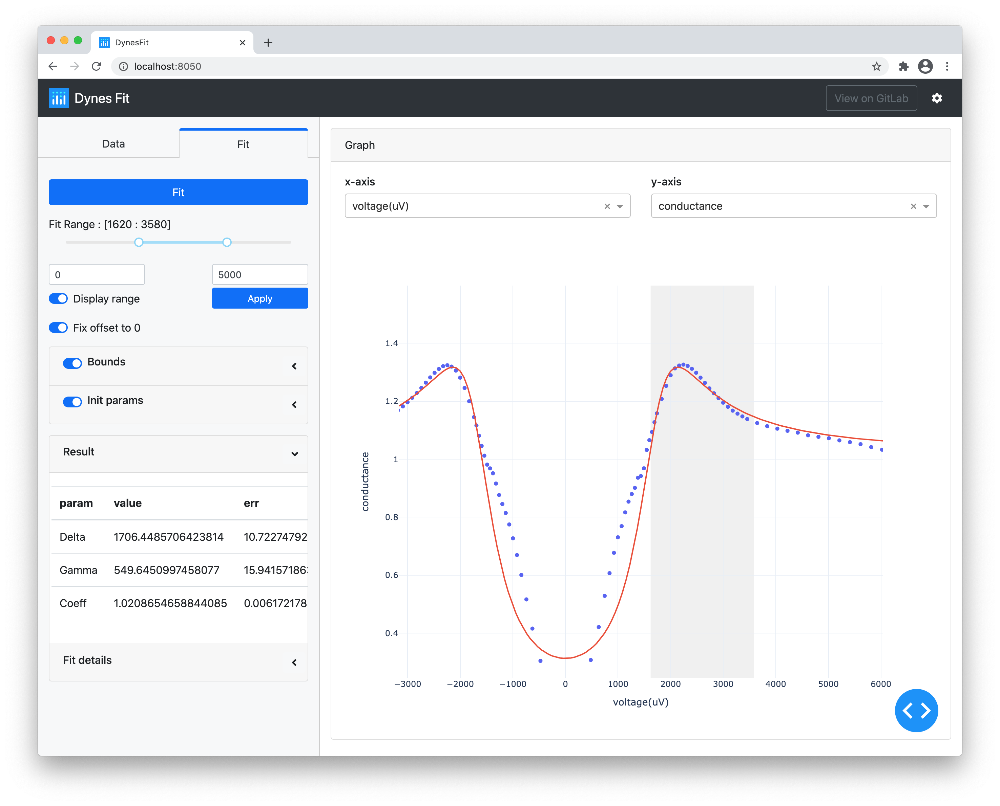

Dynes fit tool
==============



## Requirements
- numpy
- scipy
- pandas
- plotly
- dash
- dash-bootstrap-components

## Usage
Run the app with
```
$ python app.py
```
and visit http://localhost:8050/ in your web browser.

## License
Copyright (c) 2020 Takayuki YANO

The source code is licensed under the MIT License, see LICENSE.